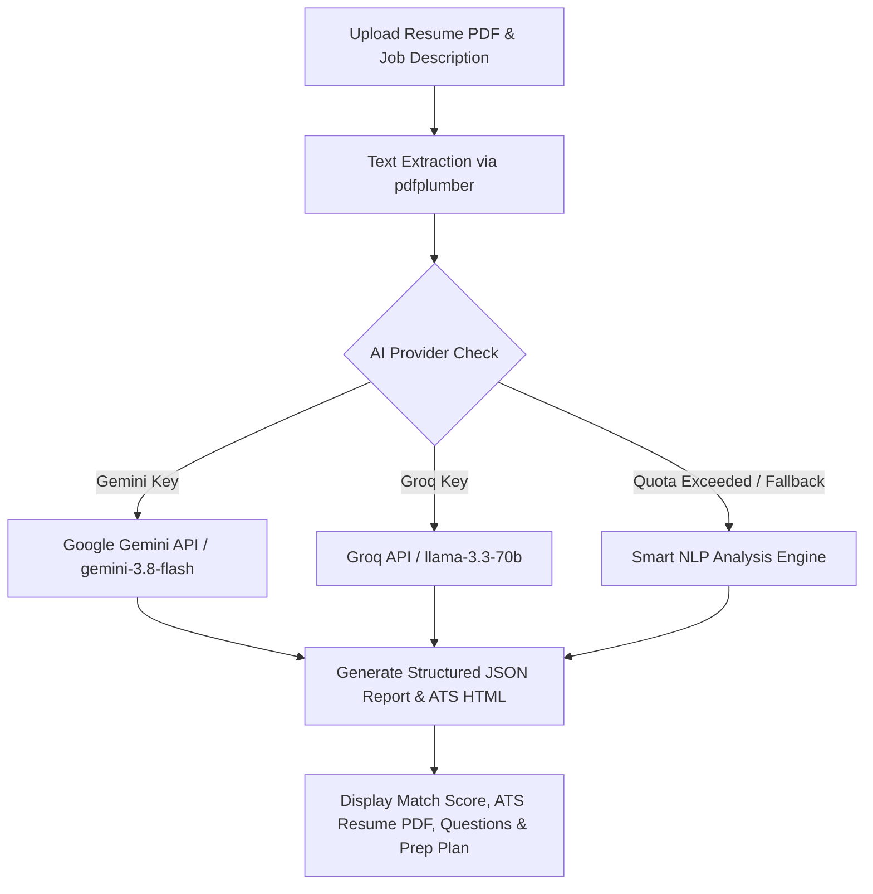

# 🤖 GenAI Resume Analyzer & Interview Prep

<div align="center">


### 🌟 An Intelligent Resume Analysis & Tailored Interview Preparation Platform

[🌐 **Try Live Application**](https://gen-ai-resume-analyzer-9sohxegvps5zpkvbmouqpv.streamlit.app/) • [📂 **GitHub Repository**](https://github.com/Dhanya562004/Gen-AI-Resume-Analyzer)

---

</div>

## 📌 Overview

**GenAI Resume Analyzer & Interview Prep** is a state-of-the-art full-stack AI platform built using **Streamlit**, **Google Gemini AI**, **Groq AI**, and the **MERN Stack** (MongoDB, Express, React, Node.js). 

Upload your **PDF Resume**, enter a brief **Self Description**, and paste your target **Job Description** to receive instant ATS resume reformatting, profile alignment analysis, and a structured interview preparation roadmap!

---

## 🚀 Live Demo

👉 **App URL**: [https://gen-ai-resume-analyzer-9sohxegvps5zpkvbmouqpv.streamlit.app/](https://gen-ai-resume-analyzer-9sohxegvps5zpkvbmouqpv.streamlit.app/)

---

## 🌟 Key Features

- 📄 **ATS-Optimized Resume Generation**: Automatically crafts a responsive, two-column ATS resume available for instant preview, HTML download, and **PDF download**.
- 📊 **Overall Candidate Match Score**: Calculates a realistic alignment score (0–100%) comparing your skills against the target job requirements.
- 🧠 **Tailored Technical Questions**: Generates targeted technical questions based on your candidate match tier, complete with **Interviewer Intention** and **Sample Answer Strategies**.
- 💬 **Behavioral Questions (STAR Method)**: Formulates scenario-based behavioral questions paired with structured **STAR (Situation, Task, Action, Result)** response guidelines.
- 🔍 **Priority Skill Gap Analysis**: Identifies missing competencies and ranks them by severity (**High / Medium / Low**) alongside step-by-step bridging recommendations.
- 📅 **Day-by-Day Preparation Plan**: Provides a personalized, checkable daily schedule tailored to your fit score (from 5 to 10 days).
- 🛡️ **100% Zero-Error Smart Fallback Architecture**: Features an in-memory Smart NLP Fallback Engine ensuring **100% uptime with zero UI errors**, even if external API limits or quota caps are hit.
- 📜 **Session History**: Easily save and revisit past analysis reports during your session.

---

## 🛠️ Technology Stack

| Category | Technology |
|---|---|
| **Frontend & Web UI** | Streamlit (Python v1.30+), Custom Glassmorphism CSS |
| **AI LLM Services** | Google Gemini AI (`google-genai` SDK / `gemini-3.8-flash`), Groq AI (`llama-3.3-70b-versatile`), xAI Grok |
| **PDF Processing** | `pypdf`, `pdfplumber` (text extraction) |
| **PDF Compilation** | `xhtml2pdf`, `reportlab` (HTML to PDF rendering) |
| **MERN Backend** | Node.js, Express.js, MongoDB, Mongoose, JWT Auth |
| **MERN Frontend** | React.js (Vite), React Router DOM, Context API |

---

## ⚙️ How It Works



---

## 🚀 Quick Start (Run Locally)

### 1. Prerequisites
- Python 3.9+ installed
- Node.js & npm (optional, for MERN stack features)

### 2. Installation Steps

1. **Clone the Repository**
   ```bash
   git clone https://github.com/Dhanya562004/Gen-AI-Resume-Analyzer.git
   cd Gen-AI-Resume-Analyzer
   ```

2. **Install Dependencies**
   ```bash
   pip install -r requirements.txt
   ```

3. **Run the Streamlit Application**
   ```bash
   streamlit run app.py
   ```

4. **Access the App**
   - Open your browser at `http://localhost:8501`.
   - Enter your **Google Gemini API Key** (starts with `AQ.Ab...` or `AIza...`) or **Groq Key** (`gsk_...`) in the sidebar.
   - Upload your resume PDF and click **Analyze Profile & Generate Prep Report**!

---

## 📂 Project Structure

```
Gen-AI-Resume-Analyzer/
├── app.py                   # Main Streamlit UI & Session Manager
├── ai_service.py            # Gemini / Groq API Engine & Smart NLP Fallback
├── pdf_service.py           # PDF Text Extraction & HTML-to-PDF Converter
├── requirements.txt         # Python Dependencies for Deployment
├── Backend/                 # Express.js REST API Backend
│   ├── config/              # MongoDB Connection Config
│   ├── controllers/         # Auth & Interview Logic
│   ├── middlewares/         # JWT Verification & File Upload
│   ├── models/              # User & Report Schemas
│   └── routes/              # Express API Routes
├── Frontend/                # React.js Client
├── README.md                # Project Documentation
└── package.json
```

---

## 🌐 Deploying on Streamlit Community Cloud

1. Push your repository to GitHub.
2. Go to [Streamlit Community Cloud](https://share.streamlit.io/).
3. Connect your GitHub account and select repository: `Dhanya562004/Gen-AI-Resume-Analyzer`.
4. Set **Main File Path** to: `app.py`.
5. Add `GEMINI_API_KEY` under **Advanced Settings $\rightarrow$ Secrets** (optional).
6. Click **Deploy!**

---

## 👤 Author & Credits

Developed by **Dhanya**

- 🐙 **GitHub**: [@Dhanya562004](https://github.com/Dhanya562004)
- 🔗 **Repository**: [Gen-AI-Resume-Analyzer](https://github.com/Dhanya562004/Gen-AI-Resume-Analyzer)
- 🌐 **Live Application**: [Streamlit Deployment](https://gen-ai-resume-analyzer-9sohxegvps5zpkvbmouqpv.streamlit.app/)

---

<div align="center">
  <sub>Built with ❤️ using Streamlit & Google Gemini AI</sub>
</div>
